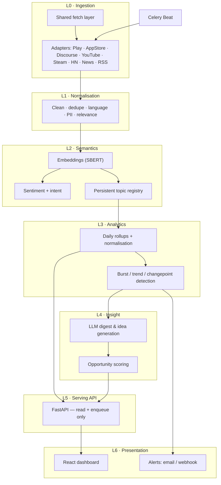
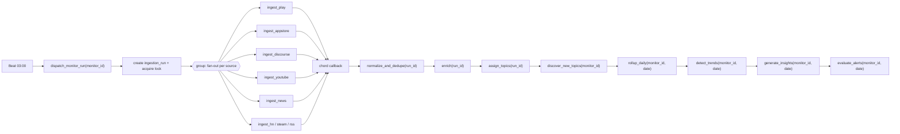

# Software Signal — Kiro Handoff

**Single source of truth.** Supersedes all earlier drafts. Everything Kiro needs to
generate `.kiro/steering/*` and the spec backlog is in this file.

**What this is:** the productisation of a published research framework
(Prasetya et al., *A Multisource Framework for Software Requirement Elicitation*,
JISEBI 12(2):443–457, 2026) from a one-shot batch pipeline into a continuous
monitoring and trend-analytics platform.

**Existing code:**
`github.com/aryapras22/multisource-fastapi` · `github.com/aryapras22/multisource-fe`

**Hard constraints (settled — do not revisit):**
1. **No paid APIs. No API keys. No approval-gated data sources.** Every source must be
   reachable with an anonymous HTTP request. This rules out Reddit and X entirely.
2. **LLM provider is pluggable** — local (Ollama), self-hosted (vLLM / OpenAI-compatible),
   or cloud. No code path may assume a specific provider.

**Conventions in this document:**
`🔍 RESEARCH` — Kiro should investigate before speccing.
`⚠ DECIDE` — needs a human answer.

---

# Part 1 — Product

## 1.1 What it does

> Give it a piece of software or a theme. It watches every day. It tells you what's
> changing, what people are angry about, what's emerging, and what you should build.

Worked example — monitoring **Roblox**:

- Daily ingest of new Google Play reviews, App Store reviews, YouTube comments,
  `devforum.roblox.com` threads, and news articles.
- Each item attaches to a **stable topic** — "voice chat moderation", "Byfron anti-cheat",
  "UGC marketplace fees", "performance on low-end Android".
- Daily aggregates per topic × source: volume, sentiment, engagement, star rating.
- **Trend detection**: bursts, sustained growth, sentiment inversions, structural breaks,
  brand-new topics.
- **Ideas**: evidence-linked product opportunities, scored.
- **Alerts** when something breaks out.

## 1.2 What the current system does (and why it can't be extended)

The published pipeline is one-shot:

```
case study text → LLM generates queries → parallel scrape (Play, App Store, News, X)
  → preprocess → extract user stories (WHO–WHAT–WHY) → SBERT embed
  → agglomerative clustering (cosine, average linkage, threshold 0.5)
  → top-10 clusters by size → centroid-nearest representative → PlantUML diagram
```

Two assumptions are baked into every layer, and both must go:

1. **A project terminates.** `status: draft → configured → analyzing → complete` and the
   `ProjectFetchState` boolean struct only make sense for a run that finishes. A monitor
   never finishes.
2. **Clustering is stateless.** Re-fitting agglomerative clustering each run means
   cluster 4 is a different cluster every time. *"Voice chat complaints grew 40% this
   week"* is unanswerable. This is the single biggest engineering problem in the pivot.

## 1.3 The seven deltas

| # | From | To | Difficulty |
|---|---|---|---|
| D1 | Batch, run-once | Scheduled, incremental, idempotent, resumable | Medium |
| D2 | Corpus snapshot | Time series, daily grain, retention policy | Medium |
| D3 | Ephemeral clusters | **Persistent topic registry, stable IDs** | **Hard — Part 6** |
| D4 | LLM per document | Tiered; LLM only at topic level | Medium |
| D5 | HTTP handlers do the work | Job queue + workers | Medium |
| D6 | Output = user stories + UML | Output = charts, trend events, alerts, ideas | Medium |
| D7 | Absolute counts are fine | **Counts are scraper artefacts — must normalise** | **Hard — Part 6** |

D3 and D7 decide whether this is an analytics product or a dashboard that plots the mood
of your scraper.

## 1.4 Two monitor modes

**Mode A — target monitoring** (`target_type = "product"`). "Watch Roblox." Seeded with
concrete identifiers: Play package ID, App Store ID, Discourse forum URL, YouTube search
terms. High precision. **Build this first.**

**Mode B — theme exploration** (`target_type = "theme"`). "Watch the AI note-taking app
space." Seeded with a description; an LLM expands it into queries — this is exactly the
existing `CaseStudyRequest → queries` flow, kept as-is. Discovers competitor apps rather
than being told them. Needs a relevance filter.

A theme is just a monitor whose target set is discovered rather than declared.

## 1.5 Questions the product must answer

| Question | Artifact |
|---|---|
| What are people talking about? | Topic volume ranking, current window |
| What's rising? | Growth rate, burst z-score, composite trend score |
| What's new? | Topics with `first_seen` in window; novel-term score |
| Is sentiment worsening, and about what? | Per-topic sentiment trend |
| Is this real or one loud thread? | Cross-source breadth, author diversity, concentration |
| What should we build? | Ranked opportunities with evidence links |
| Did something just happen? | Changepoint / anomaly events |
| How do we compare? | Share of voice, sentiment delta per competitor |

## 1.6 Non-goals for v1

Real-time streaming (daily grain; hourly is a v2 knob). Multi-tenant billing. Deep
historical backfill beyond what each source exposes. PlantUML use-case diagrams. The
rule-based (non-LLM) extraction path.

## 1.7 Product principles — non-negotiable

1. **Every insight is traceable.** No LLM output ships without clickable evidence
   document IDs. Ungrounded output is a bug, not a feature.
2. **Never present a number without its data quality.** If a source failed or a quota was
   hit, the UI says so. A missing source is *not* zero discussion.
3. **Explainability over magic.** A trend event states which method fired, its
   statistics, and which documents drove it.
4. **Stable topic identity is a correctness requirement.** If topic IDs churn, every
   chart is a lie.
5. **The human can override the machine.** Users rename, pin, merge, and reject topics.
   Automation respects those overrides.

---

# Part 2 — Data sources

Everything below is reachable anonymously. No keys, no accounts, no approvals, no cost.

## 2.1 Why Reddit and X are excluded

**X:** since February 2026 the official API is pay-per-use at ~$0.005 per post read with
no free tier. The $200 Basic tier closed to new signups and existing subscribers were
migrated to pay-per-use from 1 June 2026. Enterprise starts around $42,000/month. A daily
monitor pulling ~500 posts/day costs roughly $75/month *per monitor*.

**Reddit:** on 28 May 2026 Reddit deprecated unauthenticated `.json` endpoints — they
now return 403. Enforcement uses **TLS fingerprinting and IP reputation**, not
User-Agent checks, so the usual workarounds don't apply. The official OAuth free tier is
approval-gated and non-commercial; commercial access is a negotiated contract. Reddit has
publicly flagged **RSS as the next surface it may close**.

One detail from the Reddit shutdown is the most important operational lesson in this
document: the failure mode was frequently **HTTP 200 with empty JSON or redirect HTML**,
not a clean 403. Pipelines appeared healthy for days while writing nothing. See §5.4.

Both slot into the adapter framework later if the constraints change. Don't write
half-support now.

## 2.2 The source list

| Source | Endpoint / library | Auth | Value | Fragility |
|---|---|---|---|---|
| **Google Play reviews** | `google-play-scraper` | none | ★★★★★ | Medium |
| **App Store reviews** | `itunes.apple.com/{cc}/rss/customerreviews/page={n}/id={id}/sortby=mostrecent/json` | none | ★★★★☆ | **Low** |
| **App discovery** | `google-play-scraper.search()`, `itunes.apple.com/search?term=&entity=software` | none | ★★★☆☆ | Medium |
| **Discourse forums** | `{base}/search.json?q=`, `/latest.json`, `/t/{id}.json` | none | ★★★★★ | **Low** |
| **YouTube comments** | `yt-dlp` (`getcomments=True`, `max_comments`) | none | ★★★★★ | **High** |
| **YouTube discovery** | `yt-dlp` `ytsearch{N}:`, `youtube.com/feeds/videos.xml?channel_id=` | none | ★★★★☆ | Low (RSS) |
| **Steam reviews** | `store.steampowered.com/appreviews/{appid}?json=1&filter=recent&cursor=` | none | ★★★★★ (games) | Low |
| **Hacker News** | `hn.algolia.com/api/v1/search_by_date?query=&numericFilters=created_at_i>` | none | ★★★★☆ (dev) | **Very low** |
| **Google News** | `news.google.com/rss/search?q={q}+when:1d` + `newspaper4k` | none | ★★★☆☆ | Low |
| **Generic RSS/Atom** | `feedparser` | none | ★★★★☆ | Very low |
| **GitHub feeds** | `github.com/{repo}/releases.atom`, `/commits.atom` | none | ★★★☆☆ | Very low |
| **Mastodon** | `{instance}/api/v1/timelines/tag/{tag}?limit=40` | none* | ★★☆☆☆ | Medium |
| **Google Trends** | `pytrends` | none | ★★★☆☆ (normaliser) | High |

\* tag timelines are public on most instances; `/api/v2/search` behaviour varies.

### Two sources that punch above their weight

**Discourse.** A large share of software communities run Discourse, and every instance
exposes the same keyless JSON API. One adapter with a configurable `base_url` unlocks
dozens of communities: `devforum.roblox.com`, Figma, Docker, Rust, Godot, Elixir,
Home Assistant, and most game studios and SaaS support forums.

For Roblox specifically this is close to a direct Reddit substitute —
`devforum.roblox.com/search.json?q=voice+chat&order=latest` returns long-form,
opinionated developer discussion, keyless, low-fragility. **Build this adapter early;
it's the highest value per line of code in the ingestion layer.**

**Generic RSS/Atom.** One `feedparser` adapter covers an unbounded long tail: release
notes, status pages, changelogs, company blogs, Discourse category feeds, GitHub release
feeds, YouTube channel uploads. It also lets users add sources you never anticipated.
Make "add a feed URL" a first-class product feature.

### Steam's hidden advantage

Steam reviews carry `playtime_forever`, `voted_up`, and `received_for_free`. That lets
you weight feedback by how much the person actually used the product — something none of
the original three research sources supported. Use it.

### Google News gotcha

Google News RSS returns redirect URLs, not article URLs. `googlenewsdecoder` is already
in `requirements.txt` — keep it, and resolve before handing to `newspaper4k`.

## 2.3 Source set by target type

| Target | Sources |
|---|---|
| Consumer mobile app (Roblox) | Play + App Store + YouTube + official Discourse forum + Google News |
| PC / console game | Steam + YouTube + Discourse/forum + News |
| Dev tool / library | Hacker News + GitHub feeds + Discourse + News + RSS |
| SaaS product | App stores (if mobile) + Discourse/support forum + HN + News + RSS |
| Theme / market | Google News + HN + Play/App Store discovery + YouTube search + Trends |

Typical active source count is **4–5**, down from the 6–7 an API-based build would reach.
That affects the `breadth` metric — see §6.5.

## 2.4 What was lost, and what replaced it

Reddit's unique contribution was long-form community discussion by engaged users.

| Reddit's role | Replacement |
|---|---|
| Consumer community discussion | YouTube comments (high volume, genuinely opinionated) |
| Developer / power-user discussion | Discourse forums (structured, long-form, often official) |
| Game community discussion | Steam reviews (with playtime metadata) |
| Technical / industry discourse | Hacker News via Algolia |

Coverage is narrower; **quality per document is arguably higher.** Discourse posts and
Steam reviews are longer and more substantive than the median Reddit comment. But note
honestly in evaluation (Part 11) that these sources are *less independent* than the
original mix — YouTube and Steam both skew toward engaged consumers, Discourse toward
power users. Reddit's absence removes a genuinely distinct population.

## 2.5 Collection strategy

Per source per monitor per day:

1. **Cursor / watermark** — store `last_seen_external_id` and `last_published_at`. Fetch
   newest-first, stop on a known ID or when crossing the watermark.
2. **Fixed daily quota** — e.g. 300 Play reviews/day. Critical for D7: a stable
   denominator makes day-over-day counts comparable. Record `attempted`, `fetched`,
   `duplicates`, `kept`, `quota_hit` every run.
3. **Idempotency** — natural key `(monitor_id, source, external_id)`, unique index.
   Re-running a day is a no-op.
4. **Backfill** — separate one-shot job, wider window, flagged `is_backfill = true` so it
   never corrupts the daily series.

---

# Part 3 — Architecture

## 3.1 Layers



Key property: **every layer writes durable state and can be re-run independently.** If
the sentiment model changes, re-run L2 over stored documents without re-scraping.

## 3.2 Stack

| Concern | Choice | Rationale |
|---|---|---|
| API | FastAPI (keep) | Already there, async-native |
| Primary store | **PostgreSQL 16 + TimescaleDB** | See §3.3 |
| Vectors | **pgvector** (HNSW, cosine) in the same DB | One database, joins to metadata |
| ORM / migrations | SQLAlchemy 2.0 async + Alembic | Schema will churn heavily |
| Queue | Celery + Celery Beat, Redis broker | Boring; `chord`/`chain` fit the DAG |
| Cache / locks | Redis | Same instance |
| HTTP | **`curl_cffi`** for hardened targets, `httpx` otherwise | TLS fingerprinting (§5.1) |
| Embeddings | `sentence-transformers`, `all-MiniLM-L6-v2` (384-d) | Continuity with the paper |
| Topics | BERTopic + custom persistence layer | §6.4 |
| Stats | `statsmodels`, `ruptures`, `pymannkendall`, `scipy` | Mature, small |
| LLM | Provider-agnostic interface | Part 7 |
| Frontend | React + TS, TanStack Query, Recharts, shadcn/ui | Charts are the product |
| Deploy | Docker Compose on a VPS | Not Kubernetes |
| Observability | Structured JSON logs + Sentry + scraper-health view | Silent scraper failure is the top risk |

**Rejected:** Kubernetes, Airflow, microservices, a separate vector DB, MongoDB
(migrating away), per-document LLM calls.

**Reconsider only if:** the pipeline exceeds ~15 task types → evaluate Prefect. Row
counts approach 10⁸ → evaluate ClickHouse. Neither applies at launch.

## 3.3 Postgres over MongoDB — decided

Migrate off MongoDB. Reasons:

- The entire product is **windowed aggregation over a time series grouped by topic and
  source**. That is `GROUP BY time_bucket(...)`. In Mongo it's hand-rolled aggregation
  pipelines that get unpleasant fast.
- Timescale continuous aggregates give pre-computed rollups for free.
- Topic ↔ document ↔ metric relationships are genuinely relational.
- pgvector puts embeddings next to metadata: *"nearest neighbours to this centroid, from
  source=discourse, last 14 days"* is one query.
- Alembic gives real migrations.

The counter-argument — raw scraped payloads are schemaless — is answered by `JSONB`.
Store `documents.raw JSONB` and lose nothing.

Migration cost: roughly 1–2 weeks including data. Worth it. Do it in Phase 0, before
there's much data to move.

## 3.4 Project structure

```
backend/
  app/
    main.py                    # app factory; routers only
    config.py                  # pydantic-settings
    db/
      session.py
      models/                  # SQLAlchemy ORM, one file per aggregate
      migrations/              # Alembic
    api/v1/
      monitors.py  runs.py  topics.py  metrics.py  trends.py
      insights.py  documents.py  alerts.py  health.py
    schemas/                   # Pydantic request/response — NOT ORM models
    core/
      fetch/
        client.py              # curl_cffi + httpx sessions
        throttle.py            # per-host token bucket
        useragent.py
        cache.py
        breaker.py             # per-host circuit breaker
        validate.py            # payload shape assertions
      locks.py  logging.py  errors.py
    sources/
      base.py                  # SourceAdapter ABC + FetchExpectations
      play.py  appstore.py  discourse.py  youtube.py  steam.py
      hackernews.py  news.py  rss.py  mastodon.py  trends.py
      registry.py
    pipeline/
      normalize.py             # clean, dedupe, language, PII, relevance
      enrich.py                # embeddings, sentiment, intent
      topics/
        registry.py            # centroid store + assignment
        discovery.py           # residue clustering, new topics, merge
        labeling.py            # c-TF-IDF + LLM labels
        refit.py               # monthly refit + lineage remap
      analytics/
        rollup.py
        normalization.py       # prevalence, quota handling
        detectors/             # zscore.py poisson.py kleinberg.py
                               # mannkendall.py pelt.py novelty.py
        scoring.py             # composite trend score
      insights/
        digest.py  opportunities.py  scoring.py
    llm/
      base.py                  # LLMProvider ABC
      providers/               # ollama.py  openai_compat.py  gemini.py  anthropic.py
      router.py                # per-tier provider selection
      prompts/                 # versioned template files
    tasks/
      dispatch.py  ingest.py  enrich.py  topics.py
      analytics.py  insights.py  alerts.py  maintenance.py
      beat_schedule.py
  tests/
    unit/  integration/  contracts/   # contracts/ holds recorded source fixtures

frontend/
  src/
    pages/        # Overview Topics Trends Explorer Ideas Compare Health Settings
    components/charts/  components/ui/
    api/  hooks/
```

**Conventions.** Layers depend downward only (`api → pipeline → db`), never upward.
Pydantic schemas and ORM models are distinct types; never return an ORM object from an
endpoint. All timestamps `TIMESTAMPTZ` stored UTC; all buckets `DATE`. Adding a source =
one file in `sources/` + a registry entry + a contract test, and nothing else changes —
if something else has to change, the abstraction is wrong.

---

# Part 4 — Data model

Sketch. `🔍 RESEARCH` — Kiro should refine types, indexes, and constraints.

```sql
-- ============ Monitors ============
CREATE TABLE monitors (
  id              UUID PRIMARY KEY,
  name            TEXT NOT NULL,
  target_type     TEXT NOT NULL CHECK (target_type IN ('product','theme')),
  description     TEXT,                    -- the "case study" text, Mode B
  queries         TEXT[],
  seed_entities   JSONB,                   -- {play_ids, appstore_ids, discourse_urls,
                                           --  steam_appids, yt_queries, feed_urls}
  schedule_cron   TEXT DEFAULT '0 3 * * *',
  timezone        TEXT DEFAULT 'UTC',
  status          TEXT DEFAULT 'active',   -- active | paused | archived
  retention_days  INT  DEFAULT 730,
  created_at      TIMESTAMPTZ DEFAULT now()
);

CREATE TABLE monitor_sources (
  id            UUID PRIMARY KEY,
  monitor_id    UUID REFERENCES monitors(id) ON DELETE CASCADE,
  source        TEXT NOT NULL,   -- play|appstore|discourse|youtube|steam|hn|news|rss|mastodon
  config        JSONB NOT NULL,  -- per-source params incl. discourse base_url, feed urls
  daily_quota   INT  DEFAULT 300,
  enabled       BOOLEAN DEFAULT true,
  cursor        JSONB,           -- {last_external_id, last_published_at}
  UNIQUE (monitor_id, source, (config->>'instance_key'))
);

-- ============ Runs ============
CREATE TABLE ingestion_runs (
  id            UUID PRIMARY KEY,
  monitor_id    UUID REFERENCES monitors(id) ON DELETE CASCADE,
  run_date      DATE NOT NULL,
  is_backfill   BOOLEAN DEFAULT false,
  status        TEXT,            -- pending|running|partial|complete|failed
  stage_status  JSONB,           -- {ingest:'complete', enrich:'running', ...}
  started_at    TIMESTAMPTZ,
  finished_at   TIMESTAMPTZ,
  UNIQUE (monitor_id, run_date, is_backfill)
);

CREATE TABLE source_fetch_stats (          -- the normalisation ledger (§6.2)
  run_id            UUID REFERENCES ingestion_runs(id) ON DELETE CASCADE,
  source            TEXT,
  attempted         INT, fetched INT, duplicates INT,
  filtered_lang     INT, filtered_relevance INT, kept INT,
  quota             INT,
  quota_hit         BOOLEAN,     -- true => sample TRUNCATED, count is a FLOOR
  validation_failed BOOLEAN,     -- payload shape assertion tripped (§5.4)
  library_version   TEXT,        -- yt-dlp / google-play-scraper version
  duration_ms       INT,
  error             TEXT,
  PRIMARY KEY (run_id, source)
);

-- ============ Documents ============
CREATE TABLE documents (
  id             UUID PRIMARY KEY,
  monitor_id     UUID REFERENCES monitors(id) ON DELETE CASCADE,
  source         TEXT NOT NULL,
  external_id    TEXT NOT NULL,
  entity_id      TEXT,           -- app id / forum slug / steam appid / video id
  url            TEXT,
  author_hash    TEXT,           -- hashed, never raw
  title          TEXT,
  body           TEXT NOT NULL,
  body_clean     TEXT,
  lang           TEXT,
  published_at   TIMESTAMPTZ NOT NULL,
  collected_at   TIMESTAMPTZ DEFAULT now(),
  rating         NUMERIC,        -- app reviews: 1-5; steam: voted_up as 0/1
  app_version    TEXT,           -- lets you attribute a spike to a release
  playtime_hours NUMERIC,        -- steam only
  engagement     JSONB,          -- {likes, replies, upvotes, points, views}
  content_hash   TEXT NOT NULL,
  simhash        BIGINT,         -- near-dupe / bot detection
  raw            JSONB,
  first_run_id   UUID REFERENCES ingestion_runs(id),
  UNIQUE (monitor_id, source, external_id)
);
CREATE INDEX ON documents (monitor_id, published_at DESC);
CREATE INDEX ON documents (monitor_id, source, published_at DESC);

CREATE TABLE document_enrichment (
  document_id     UUID PRIMARY KEY REFERENCES documents(id) ON DELETE CASCADE,
  embedding       VECTOR(384),
  sentiment       NUMERIC,        -- -1..1
  sentiment_label TEXT,
  intent          TEXT,           -- feature_request|bug_report|praise|complaint|
                                  -- question|churn_signal|pricing|competitor|spam
  intent_conf     NUMERIC,
  aspects         JSONB,
  is_relevant     BOOLEAN,
  relevance_score NUMERIC,
  model_versions  JSONB,          -- {embed, sentiment, intent} — enables selective re-run
  enriched_at     TIMESTAMPTZ DEFAULT now()
);
CREATE INDEX ON document_enrichment USING hnsw (embedding vector_cosine_ops);

-- ============ Topics (§6.4) ============
CREATE TABLE topics (
  id           UUID PRIMARY KEY,
  monitor_id   UUID REFERENCES monitors(id) ON DELETE CASCADE,
  label        TEXT,              -- LLM-generated or c-TF-IDF keywords; user-editable
  keywords     TEXT[],
  centroid     VECTOR(384),
  doc_count    INT DEFAULT 0,
  first_seen   DATE,
  last_seen    DATE,
  status       TEXT DEFAULT 'active',   -- active|dormant|merged|archived
  merged_into  UUID REFERENCES topics(id),
  drift_score  NUMERIC,
  is_pinned    BOOLEAN DEFAULT false,   -- user-defined; never auto-merged
  created_at   TIMESTAMPTZ DEFAULT now()
);

CREATE TABLE topic_assignments (
  document_id  UUID PRIMARY KEY REFERENCES documents(id) ON DELETE CASCADE,
  topic_id     UUID REFERENCES topics(id),
  similarity   NUMERIC,
  method       TEXT,              -- centroid|clustered|zeroshot|manual
  assigned_at  TIMESTAMPTZ DEFAULT now()
);

CREATE TABLE topic_lineage (
  id          UUID PRIMARY KEY,
  from_topic  UUID, to_topic UUID,
  event       TEXT,               -- merge|split|refit_remap
  occurred_at TIMESTAMPTZ DEFAULT now(),
  reason      JSONB
);

-- ============ Metrics ============
CREATE TABLE daily_metrics (
  monitor_id       UUID NOT NULL,
  bucket           DATE NOT NULL,
  source           TEXT NOT NULL,   -- or '__all__'
  topic_id         UUID,            -- NULL => monitor-level
  doc_count        INT,
  doc_count_norm   NUMERIC,         -- doc_count / sample_size — plot THIS
  sample_size      INT,
  quota_hit        BOOLEAN,
  sentiment_mean   NUMERIC,
  sentiment_p25    NUMERIC,
  negativity_rate  NUMERIC,
  engagement_sum   NUMERIC,
  author_diversity NUMERIC,         -- unique authors / docs
  rating_mean      NUMERIC,
  intent_counts    JSONB,
  PRIMARY KEY (monitor_id, bucket, source, topic_id)
);
SELECT create_hypertable('daily_metrics','bucket');

-- ============ Trend events & insights ============
CREATE TABLE trend_events (
  id           UUID PRIMARY KEY,
  monitor_id   UUID, topic_id UUID,
  detected_on  DATE,
  event_type   TEXT,   -- burst|sustained_growth|decline|new_topic|
                       -- sentiment_flip|changepoint|anomaly
  method       TEXT,   -- zscore_mad|poisson|kleinberg|mann_kendall|pelt|novelty
  severity     NUMERIC,
  statistics   JSONB,  -- {z, p, slope, baseline, observed, window}
  evidence_ids UUID[],
  status       TEXT DEFAULT 'open',
  UNIQUE (monitor_id, topic_id, detected_on, event_type)
);

CREATE TABLE insights (
  id             UUID PRIMARY KEY,
  monitor_id     UUID, topic_id UUID,
  period_start   DATE, period_end DATE,
  kind           TEXT,   -- digest|opportunity|user_story|risk
  title          TEXT,
  body           TEXT,
  who            TEXT, what TEXT, why TEXT,   -- the paper's WHO-WHAT-WHY, preserved
  scores         JSONB,  -- {opportunity, frequency, severity, breadth, recency, confidence}
  evidence_ids   UUID[],
  llm_provider   TEXT,
  llm_model      TEXT,
  prompt_version TEXT,
  created_at     TIMESTAMPTZ DEFAULT now()
);

-- ============ Scraper health ============
CREATE TABLE source_health (
  monitor_id      UUID, source TEXT,
  last_success_at TIMESTAMPTZ,
  consecutive_empty INT DEFAULT 0,
  consecutive_fail  INT DEFAULT 0,
  rows_median_28d   NUMERIC,
  library_version   TEXT,
  state             TEXT,   -- healthy|degraded|broken|disabled
  PRIMARY KEY (monitor_id, source)
);
```

`insights.who/what/why` is where the research contribution survives — now attached to a
topic and a time window rather than a whole project.

---

# Part 5 — Ingestion

## 5.1 Shared fetch layer

With no APIs, every adapter is a scraper, so the HTTP client is a core component rather
than an implementation detail. No adapter creates its own client.

- **Use `curl_cffi` with browser TLS impersonation** for Google properties and YouTube.
  Plain `httpx`/`requests` are identifiable at the TLS handshake regardless of headers —
  that is precisely the mechanism that killed unauthenticated Reddit access. Use `httpx`
  for the benign sources (HN, Discourse, RSS, Steam).
- **Per-host token bucket**, not a global limit. Play Store and Hacker News share nothing
  and shouldn't share a budget.
- **Randomised jitter** between requests. Perfectly regular intervals are a bot signature.
- **Response cache** keyed by URL + date, so retries don't refetch.
- **Per-host circuit breaker.**
- **Off-peak scheduling** — 03:00 local is politer and less throttled.

## 5.2 Adapter interface

```python
class SourceAdapter(ABC):
    name: str
    expectations: FetchExpectations

    @abstractmethod
    async def discover(self, monitor: Monitor) -> list[Entity]: ...

    @abstractmethod
    async def fetch(self, entity: Entity, cursor: Cursor,
                    quota: int) -> FetchResult: ...
```

`FetchResult` carries `rows`, the new cursor, and the stats that populate
`source_fetch_stats`.

## 5.3 Orchestration DAG



Rules that make this survivable:

- **One `ingestion_run` per (monitor, date)**, unique-constrained, guarded by a Redis lock
  keyed `run:{monitor_id}:{date}` with a TTL longer than the worst-case run.
- **Every task takes `run_id` and is idempotent.** Re-running after a crash produces
  identical state. `stage_status` allows mid-DAG resume.
- **Per-source failure is partial, not fatal.** The chord still fires; the run is marked
  `partial`; trend detection is told the sample was incomplete rather than seeing a dip.
- **Retries** with exponential backoff and jitter, `max_retries=3`, dead-letter table.
- **Two queues.** `io` (scraping — high concurrency, low CPU) and `cpu` (embeddings,
  clustering — low concurrency). Never mix; one embedding job must not block twenty fetches.
- **Load ML models once per worker process** (`worker_process_init`), never per task.
- **Workers must be able to run on a different host** from the API and DB. No localhost
  assumptions, no shared local filesystem. This matters for §5.5.

## 5.4 Payload validation is load-bearing — P0

> Every adapter validates its response shape before returning. An unexpected shape, HTML
> where JSON was expected, missing required fields, or an empty result set from a source
> that is never empty raises and marks the source failed. **It never returns an empty
> list silently.**

The Reddit shutdown is the cautionary tale: HTTP 200 with empty payloads for days, and
nobody noticed because the code path looked healthy. In a trend product a silently-empty
scraper doesn't produce an error — it produces a **confident downward trend line**, which
the LLM then explains in fluent prose. Wrong, invisible, and articulate.

```python
class PlayAdapter(SourceAdapter):
    expectations = FetchExpectations(
        min_rows_when_healthy=1,
        required_fields={"reviewId", "content", "score", "at"},
        max_empty_runs_before_alert=2,
        content_type="application/json",
    )
```

Two consecutive empty runs from a source that has never been empty raises a **scraper
alert**, routed separately from product alerts. The user must never see "interest
declined" when the truth is "the scraper broke."

## 5.5 ⚠ DECIDE — datacenter IP blocking

YouTube and Google properties flag AWS/GCP/Azure egress ranges aggressively. `yt-dlp`
from a laptop works; `yt-dlp` from a VPS on a nightly cron gets challenged. This is the
biggest practical obstacle to a no-API daily monitor.

| Option | Cost | Trade-off |
|---|---|---|
| **Low-and-slow from the VPS** (20–30 videos/day, heavy jitter) | $0 | Usually survives. Smaller sample, but §6.2 makes a small *stable* sample fine. **Start here.** |
| Split execution: scrapers on a home machine / Pi with residential IP, tunnelled to the VPS | ~$0 | Best reliability per dollar. Adds a tunnel and offline handling |
| Drop YouTube; lean on Discourse + Steam + HN | $0 | Simplest; loses the highest-volume consumer signal |
| Residential proxy pool | $30–100/mo | Works, but is a paid third-party service |

For daily trend detection you need a *consistent* sample, not a large one. 30 videos ×
~50 comments ≈ 1,500 documents/day is plenty.

## 5.6 Scraper library maintenance

YouTube breaks `yt-dlp` regularly, sometimes several times a month. A pinned version will
silently stop working.

- Pin for reproducibility, but run a **weekly auto-update job** plus a smoke test against
  a known-good target.
- A failing smoke test **disables the source and alerts**, rather than poisoning the series.
- Same pattern for `google-play-scraper` and `pytrends`.
- Record `library_version` in `source_fetch_stats` so a series break can be correlated
  with an upgrade.

Ship a **scraper-health page** in Phase 1: per source, last success, rows vs 28-day
median, library version, state. You will look at this more than any other page for the
first three months.

---

# Part 6 — Analytics engine

## 6.1 Metric definitions

Let `V(t,m,s,k)` = document count on day `t` for monitor `m`, source `s`, topic `k`.
Let `N(t,m,s)` = total kept documents that day for that source.

| Metric | Formula | Note |
|---|---|---|
| Prevalence | `p = V / N` | **Plot this, not V** |
| Share of voice | `SoV = V(k) / Σ_k V(k)` | Composition |
| WoW growth | `(V_t − V_{t−7}) / max(V_{t−7}, 1)` | Noisy at low counts |
| Smoothed level | `EWMA_α(V)`, α ≈ 0.3 | For display |
| Burst z (robust) | `z = 0.6745·(V_t − median₂₈) / MAD₂₈` | MAD beats σ |
| Burst p (low counts) | `P(X ≥ V_t \| X~Poisson(λ̂))` | When `V_t < 20`; NegBinom if overdispersed |
| Trend direction | Mann–Kendall S over 30d + Theil–Sen slope | Non-parametric |
| Changepoint | `ruptures` PELT, `model="rbf"` | On the normalised series |
| Seasonality | STL decompose, weekly period | Reviews spike at weekends |
| Novelty | `c-TF-IDF(window) − c-TF-IDF(baseline)` per term | Emerging vocabulary |
| Breadth | see §6.5 | Cross-source corroboration |
| Concentration | Gini / HHI over `author_hash` | Guards against one loud thread |
| Sentiment shift | `mean(win) − mean(base)`, Mann–Whitney U | Report effect size + p |

## 6.2 Normalisation — implement in Phase 0, not Phase 3

**Scraped volume measures your scraper, not the world.** With fragile scrapers and no
APIs, this is the only thing standing between you and fictional trends.

If Monday collected 300 Play reviews (quota hit) and Tuesday 180 (quota not hit), a naïve
chart shows a 40% collapse in interest. It shows nothing of the sort.

In order of importance:

1. **Fixed daily quota per source.** Boring; solves 80% of it.
2. **Report prevalence `V/N`, never raw `V`.** Topic share within a fixed-size sample is
   comparable across days even when N drifts.
3. **Propagate `quota_hit`.** If the quota was hit, true volume exceeded the sample — the
   count is a *floor*. Render truncated days differently; exclude from baseline estimation.
4. **Mark partial runs.** A day with a failed source is not a day with less discussion.
   Impute from that source's recent share, or drop the day from that source's series.
   Never treat it as zero.
5. **External normaliser (optional).** Google Trends interest as a sanity denominator.
6. **Volume-integrity monitor.** Alert when `N` itself drops >50% vs its own 28-day
   baseline. This is a *scraper* alert and must be visually distinct from a product alert.

## 6.3 Trend detection — layered

Run several methods and let them vote.

```
Layer 1  Point anomaly      robust z (MAD) + Poisson exact for low counts
Layer 2  State burst        Kleinberg 2-state automaton (sustained, not spiky)
Layer 3  Trend test         Mann–Kendall + Theil–Sen over 30/90d
Layer 4  Structural break   PELT changepoint on prevalence and on sentiment
Layer 5  Emergence          new topic, or first crossing of a volume floor
Layer 6  Semantic novelty   c-TF-IDF delta vs baseline window
```

**Composite trend score** (calibrate on your own data; these are a starting point):

```
trend_score =
    0.30 · norm(burst_z)
  + 0.20 · norm(growth_rate_7d)
  + 0.15 · norm(novelty_score)
  + 0.15 · norm(breadth_ratio)
  + 0.10 · norm(|sentiment_delta|)
  + 0.10 · norm(log1p(volume))
  × penalty(concentration)     # ×0.5 if one author/thread dominates
  × penalty(data_quality)      # ×0 if quota_hit or partial run
```

**Guardrails — the main failure mode of trend dashboards is false positives:**
- Minimum absolute volume floor (`V_t ≥ 5`) before any event fires.
- Baseline requires ≥14 clean days.
- **Benjamini–Hochberg FDR correction** across all topics tested the same day. Dozens of
  simultaneous tests will otherwise manufacture a "significant" trend daily by chance.
- Cooldown: same `(topic, event_type)` cannot re-fire within N days.

## 6.4 Persistent topics — the hard part (D3)

Topic IDs must be stable across days or every chart is meaningless.

**Design: centroid registry as the backbone, periodic clustering for discovery.**

```
DAILY
  1. Embed new documents (SBERT).
  2. For each doc, find nearest active topic centroid via pgvector HNSW.
       if cos_sim >= τ_assign (start 0.55):
           assign
           centroid ← (1−β)·centroid + β·embedding      # β ≈ 0.02, slow drift
           drift_score += ||Δcentroid||
       else:
           push to residue pool
  3. Rollup metrics.

WEEKLY (or when |residue| >= 150)
  4. Cluster residue: HDBSCAN (min_cluster_size 8–15) over UMAP-reduced embeddings.
  5. For each candidate cluster:
       if max cos_sim(candidate, existing) >= τ_merge (start 0.75):
           merge into existing; write topic_lineage(merge)
       else:
           create topic; c-TF-IDF keywords; LLM label; first_seen = today
           → emits a `new_topic` trend event
  6. Topics with 0 docs for 60d → status='dormant'. Never deleted.

MONTHLY
  7. Full BERTopic refit over the trailing window. Match to the registry with the
     Hungarian algorithm on centroid similarity. Write topic_lineage(refit_remap).
     APPLY ONLY IF ARI vs current assignment >= 0.6.
     Never silently rewrite history — lineage rows keep old charts resolvable.
  8. Split detection: high drift_score or bimodal intra-topic similarity → PROPOSE a
     split to the user. Never auto-split.
```

**Human in the loop.** The published paper's own limitations section flags the absence of
HIL validation. Here it's cheap and high-value: users rename, pin, merge, and reject
topics. Pinned topics are never auto-merged; manual assignments are never reassigned.

`🔍 RESEARCH` — tune `τ_assign`, `τ_merge`, `β`, and `min_cluster_size` on real Roblox
data. Measure stability via week-to-week ARI and coherence via NPMI / c_v. Report the
sensitivity curve.

## 6.5 Breadth — use the ratio, not the count

With 4–5 sources instead of 6–7, absolute counts mislead:

```
breadth_ratio = sources_where_topic_present / sources_active_that_day
```

Corroboration across 2 of 4 active sources is stronger evidence than 2 of 7, and a raw
count hides that. The ratio also stays meaningful when a source is down and when you add
sources later.

This metric is where the published research becomes a product feature. The paper's
finding that sources are *complementary* implies a signal visible in ≥2 independent
sources is materially more trustworthy. Surface it as a headline badge —
"corroborated across 3 of 4 sources" — because it's the thing single-source competitors
structurally cannot say.

## 6.6 Sentiment and intent

- **Sentiment:** a small local model (e.g. `cardiffnlp/twitter-roberta-base-sentiment-latest`)
  beats a lexicon and costs nothing per call. Never send documents to an LLM for
  sentiment — that's the classic cost mistake.
- **Intent taxonomy:**
  `feature_request | bug_report | praise | complaint | question | churn_signal | pricing | competitor_mention | spam`
- **Calibration gift:** app-store `rating` and Steam `voted_up` are ground-truth sentiment
  labels. Use them to validate and calibrate the classifier for free.
- **Release attribution:** `app_version` lets you tie a sentiment changepoint to a
  specific release. Nearly free, and a genuinely killer feature. Make sure the scraper
  captures it.
- Aspect-based sentiment is a v2 item. Topic-level sentiment is free and sufficient for v1.

## 6.7 Ideas and opportunities

The WHO–WHAT–WHY generator survives, but runs at **topic level over a time window**, not
per raw document.

```
input:  topic + top-N representative documents in the window
        + trend statistics + sentiment profile + intent mix
output: 1–3 opportunities, each with WHO / WHAT / WHY, evidence document IDs, and a score
```

**Opportunity score** — an evidence-derived RICE variant:

```
opportunity =
    w1 · frequency       # normalised topic volume in window
  + w2 · severity        # negativity_rate × mean |sentiment| of negative docs
  + w3 · momentum        # trend_score (§6.3)
  + w4 · breadth_ratio
  + w5 · intent_purity   # share tagged feature_request | bug_report
  − w6 · staleness       # days since last mention
```

Every opportunity links to the documents that generated it. Ungrounded LLM output is the
fastest way to lose a user's trust; a clickable evidence trail is the fastest way to keep it.

**PlantUML use-case diagrams: dropped from v1.** The paper itself calls them
supplementary, and they don't serve a monitoring workflow. Keep the code; expose it as an
export button later if anyone asks.

---

# Part 7 — LLM layer

## 7.1 Provider-agnostic by design

The LLM is pluggable: local (Ollama), self-hosted (vLLM or any OpenAI-compatible server),
or cloud (Gemini, Anthropic, OpenAI). No code path may assume a provider.

```python
class LLMProvider(ABC):
    @abstractmethod
    async def complete(self, prompt: str, *, schema: type[BaseModel],
                       temperature: float = 0.2) -> BaseModel: ...
```

Implementations: `OllamaProvider`, `OpenAICompatProvider` (covers vLLM, LM Studio,
llama.cpp server, OpenRouter, Together), `GeminiProvider`, `AnthropicProvider`.

**Structured output is mandatory.** Use JSON-schema-constrained decoding where the
provider supports it (Ollama's `format`, OpenAI-compatible `response_format`), and always
validate with Pydantic afterward with exactly one retry. Malformed output after the retry
fails the task — never persist a partial insight.

## 7.2 Per-tier routing

Different tiers have different quality requirements, so configure a provider *per tier*:

```env
LLM_TIER1_PROVIDER=ollama          # intent classification (batched, high volume)
LLM_TIER1_MODEL=qwen3:14b

LLM_TIER2_PROVIDER=ollama          # topic labels (few calls)
LLM_TIER2_MODEL=qwen3:14b

LLM_TIER3_PROVIDER=ollama          # digests + opportunities (quality-sensitive)
LLM_TIER3_MODEL=qwen3:14b
# swap to gemini / vllm by changing these two lines — no code change
```

| Tier | Runs on | Volume/monitor/day | Quality sensitivity |
|---|---|---|---|
| T0 | Every doc — embeddings, sentiment, language, PII | ~1,500 | N/A (not an LLM) |
| T1 | New docs, batched 30–50 per call | ~30–50 calls | Low |
| T2 | New topic labels only | ~0–5 calls | Low |
| T3 | Daily digest + opportunities, ~10–30 topics | ~10–30 calls | **High** |

Total LLM calls per monitor per day: roughly **50–85**, not thousands. That's what makes
any provider choice affordable, including cloud.

## 7.3 Quality expectations from your own benchmark

The published paper benchmarked exactly this decision. F1 on app reviews:

| Model | WHO | WHAT | WHY |
|---|---|---|---|
| Gemini 2.5 Flash | 0.64 | 0.61 | **0.97** |
| GPT-OSS:20b | 0.55 | **0.69** | 0.08 |
| Qwen 3:14b | 0.49 | 0.65 | 0.06 |
| Mistral 7b | 0.62 | 0.65 | 0.06 |
| Gemma:e4b | 0.44 | 0.68 | 0.08 |

Read this as: **local models handle WHAT competently and collapse on WHY.** Since WHY is
the motivation field in every opportunity, that gap lands directly on the T3 output.

Two things worth knowing:

1. The benchmark extracted WHY from **single short, context-poor documents**. The new
   pipeline extracts at topic level with 10–20 representative documents plus trend
   statistics as context. Local models may do substantially better with that much
   context — **untested, and a legitimate small experiment worth running early.**
2. If local T3 quality proves inadequate, the hybrid is cheap: local for T1/T2, cloud for
   the ~10–30 T3 calls per monitor per day. That's a trivial cloud bill.

**Recommended default:** all-local via Ollama, with the T3 experiment in Phase 4. Ship
with `LLM_TIER3_*` documented as the one knob to turn if opportunity quality disappoints.

## 7.4 Hardware notes

- SBERT `all-MiniLM-L6-v2` (33M params) runs fine on CPU. No GPU required for T0.
- A 14B model at Q4 needs ~10GB VRAM. Without a GPU, use a 7–8B model for T1/T2 and
  either accept degraded T3 or route T3 to cloud.
- Set `keep_alive` on Ollama so the model isn't reloaded per call.
- Batch T1 aggressively — 30–50 documents per prompt — and cap output tokens.

## 7.5 Operational rules

- Cache every response by `content_hash` + `prompt_version`. Never reprocess.
- Store `llm_provider`, `llm_model`, `prompt_version` on every generated row.
- Prompts are **versioned files** in `app/llm/prompts/`, never inline strings.
- Meter latency, tokens, and (if cloud) cost per tier per monitor; alert on budget.
- Temperature ≤ 0.3 for extraction tasks; seed where the provider supports it.

---

# Part 8 — API surface

```
POST   /monitors                          create (Mode A or B)
GET    /monitors
GET    /monitors/{id}                     config + health + last run
PATCH  /monitors/{id}                     pause / resume / edit
POST   /monitors/{id}/queries:generate    LLM query expansion (Mode B)
POST   /monitors/{id}/runs                trigger now → 202 + run_id
GET    /monitors/{id}/runs                run history + per-source stats

GET    /monitors/{id}/overview            headline KPIs for a date range
GET    /monitors/{id}/timeseries          ?metric=&topic_id=&source=&from=&to=&granularity=
GET    /monitors/{id}/topics              ranked, with trend_score, sparkline, deltas
GET    /monitors/{id}/topics/{tid}        detail + evidence + timeline
PATCH  /monitors/{id}/topics/{tid}        rename / pin / merge / mark noise
GET    /monitors/{id}/trends              trend_events, filterable
GET    /monitors/{id}/insights            digests + opportunities
GET    /monitors/{id}/documents           searchable evidence browser
GET    /monitors/{id}/compare             ?entities=  share of voice
GET    /monitors/{id}/health              scraper health per source

POST   /alerts                            rule CRUD
GET    /monitors/{id}/export              CSV / JSON
```

- Long operations return **202 + `run_id`**; the client polls or opens an SSE stream.
  The current pattern of doing work inside the request must go.
- Replace the static `x-api-key` middleware with real auth (JWT/session); keep an API-key
  path for programmatic access.
- **Every metric response carries a `data_quality` block:**
  `{sample_size, quota_hit_days, sources_ok, sources_failed}` so the UI can render
  caveats instead of pretending the chart is clean.

---

# Part 9 — Frontend

Pages: **Overview · Topics · Trends · Explorer · Ideas · Compare · Health · Settings**

- **Overview** — volume sparkline, sentiment gauge, top 5 rising topics, open alerts, and
  a data-health strip (which sources ran, which hit quota).
- **Topics** — ranked table with sparklines, Δ7d, Δ30d, sentiment, breadth badge. Click
  through to a topic timeline with trend events and app-version markers annotated on the
  x-axis.
- **Trends** — event feed. Each event states what fired, which method, how strong, and
  which documents. Explainability *is* the feature.
- **Ideas** — opportunity cards expanding to evidence documents. Thumbs up/down feeds
  back into scoring weights.
- **Explorer** — raw document search with filters. Users don't trust aggregates until
  they've spot-checked the text a few times. Make that easy and they'll trust everything else.
- **Health** — per-source freshness, rows vs median, library version, state. Unglamorous
  and the most-visited page for the first three months.

Charting: Recharts for line/bar/area. Reach for visx or D3 only for a topic-stream
(ThemeRiver) view.

Days that were truncated or partial must be **visually distinguished** on every chart,
with an explanation on hover.

---

# Part 10 — Reuse map

| Existing asset | Action | Note |
|---|---|---|
| LLM query generation from case study | ✅ Keep | Becomes Mode B seeding |
| Google Play / App Store adapters | ✅ Keep, refactor | Add cursors, quotas, validation, contract tests |
| News adapter (gnews + newspaper4k) + read-through cache | ✅ Keep | Cache pattern is already right; keep `googlenewsdecoder` |
| Text preprocessing (NFKC, PII, emoji, hashtag/cashtag, dateline strip) | ✅ **Keep verbatim** | Well-designed, source-specific, hard-won |
| SBERT embedding (all-MiniLM-L6-v2) | ✅ Keep | Continuity with the paper |
| Agglomerative clustering | 🔄 **Replace** | With the persistent registry (§6.4) |
| Centroid-nearest representative selection | ✅ Keep | Reuse for topic representatives |
| AI user-story prompts (WHO/WHAT/WHY + confidence) | ✅ Keep, rehome | Move to topic level (§6.7) |
| `Insight` / `FitScore` models (NFR, business impact, JTBD) | ✅ Keep | Feeds opportunity scoring |
| Rule-based extraction (POS chunking) | 📦 Archive | Paper shows F1 0.22–0.40. Keep for reproducibility, not in the product path |
| PlantUML use-case generation | 📦 Archive | Supplementary per the paper; re-expose as export later |
| X/Twitter adapter | ❌ Delete | Not viable without paid API |
| `ProjectFetchState` booleans | ❌ Delete | Replaced by `ingestion_runs.stage_status` |
| `status: draft→…→complete` | ❌ Delete | Replaced by `active/paused/archived` |
| Static `x-api-key` middleware | 🔄 Replace | Real auth |
| Sync `pymongo` | 🔄 Replace | SQLAlchemy 2.0 async |
| Frontend shell, routing, component library | ✅ Keep | Rebuild pages, keep the scaffolding |

Roughly **half the existing backend survives.** The scrapers and preprocessing are the
valuable, boring, already-debugged parts. What gets rewritten is orchestration and
analytics, which barely exist today.

---

# Part 11 — Roadmap

### Phase 0 — Foundation (week 1–2)
Postgres + Timescale + pgvector; Alembic; Celery + Redis; Docker Compose; `Monitor` CRUD;
**the shared fetch layer including payload validation**; Google Play end-to-end with
cursor, quota, dedupe, stats ledger; **prevalence normalisation from day one.**

*Done when:* Roblox Play reviews ingest daily for 7 consecutive days with zero duplicates
and a complete `source_fetch_stats` row per day — **and** deliberately corrupting the
adapter's response shape in a test causes a loud failure, not an empty write.

### Phase 1 — Multi-source (week 3–4)
App Store RSS, Discourse (generic, tested against `devforum.roblox.com`), Hacker News,
Google News, generic RSS, Steam, and YouTube via yt-dlp with smoke test and auto-update.
Contract test per adapter. Circuit breakers, partial-run semantics, backfill.
Scraper-health page.

*Done when:* killing any single source mid-run yields `status='partial'` with correct
stats and an annotated — not corrupted — daily series.

### Phase 2 — Semantics (week 5–6)
Embeddings, sentiment, intent, relevance filter. LLM provider abstraction with Ollama
default. Persistent topic registry: incremental assignment, weekly residue clustering,
LLM labelling.

*Done when:* topic IDs are stable across 4 consecutive weeks (week-to-week ARI ≥ 0.6) on
real data.

### Phase 3 — Analytics (week 7–8)
Daily rollups, normalisation, the six detection layers, composite trend score, FDR
correction, `trend_events`.

*Done when:* on a 60-day Roblox backfill the system flags known real-world events (a major
update, an outage, a policy change) and the false-positive rate on a hand-labelled set is
acceptable.

### Phase 4 — Insight & UI (week 9–11)
Dashboard, topic drill-down, trend feed, LLM digest, opportunity cards with evidence,
alerts. **Run the T3 local-vs-cloud quality experiment (§7.3) here.**

*Done when:* you can open the app cold and, in 60 seconds, say something true and
non-obvious about Roblox this week.

### Phase 5 — Polish (week 12+)
HIL topic editing, competitor compare, exports, aspect-based sentiment, Google Trends
normaliser, multi-user auth.

**If time-boxed:** Phases 0–3 plus a minimal Phase 4 is the real product. All of Phase 5
is optional.

---

# Part 12 — Evaluation

If this is also thesis work, these are measurable and defensible:

1. **Relevance filter** — precision/recall vs a hand-labelled sample (n ≈ 300).
2. **Topic quality** — NPMI and c_v coherence; topic diversity.
3. **Topic stability** — ARI between consecutive weekly assignments. This is the headline
   number for the persistent-registry contribution, and nobody in the data-driven RE
   literature reports it.
4. **Trend detection** — build a labelled event set (a Roblox update, an outage, a pricing
   change, a viral controversy) from public timelines. Report precision, recall, and lead
   time per detection layer and for the ensemble.
5. **Normalisation study** — compare raw counts, prevalence, and external-index
   normalisation on series stability and false-positive rate. **The most novel piece and
   the most likely second publication** — the literature largely ignores it.
6. **Cross-source corroboration** — does a signal appearing in ≥2 sources have a higher
   hit rate against the labelled event set than a single-source signal? A direct
   quantitative test of the paper's complementarity claim in a temporal setting, and the
   cleanest intellectual link back to the published work.
7. **LLM tier comparison** — local vs cloud on T3 opportunity quality, replicating the
   paper's WHO/WHAT/WHY breakdown but at topic level with richer context.
8. **Expert evaluation** — same design as the original paper (coherence, time saved,
   requirements found that manual review missed), now on opportunities.

Acknowledge in limitations that the source mix is less independent than the paper's
(YouTube and Steam both skew toward engaged consumers; Discourse toward power users), and
that Reddit's exclusion removes a distinct population.

---

# Part 13 — Risks

| Risk | Mitigation |
|---|---|
| **Silent scraper failure produces plausible-but-false trends** | Payload validation (§5.4), volume-integrity alerts, `data_quality` in every response. **Top risk.** |
| Datacenter IP blocking (YouTube) | §5.5 — start low-and-slow |
| `yt-dlp` / scraper library breakage | Weekly auto-update + smoke test + auto-disable (§5.6) |
| TLS fingerprinting | `curl_cffi` browser impersonation (§5.1) |
| ToS exposure | §14 — deliberate posture, not drift |
| PII in user-generated text | Hash authors, strip PII at normalisation (already implemented) |
| LLM hallucinated insights | Every insight carries `evidence_ids`; UI always shows source text |
| Bot / brigade contamination | `author_diversity`, concentration penalty, simhash near-dupe detection |
| Multiple-comparisons false positives | FDR correction + volume floors + cooldowns |
| Embedding model upgrade invalidates history | `model_versions` per document; re-embed as an explicit versioned migration |
| Local LLM quality on WHY | §7.3 — measure early; hybrid fallback is cheap |

---

# Part 14 — Legal and ToS posture

With no APIs, **every source is scraped**, so the picture is uniformly grey rather than
mixed. Plain facts, not legal advice:

- Google Play's and Apple's terms restrict automated access. `google-play-scraper` is
  widely used in published academic work — including yours — but it isn't sanctioned.
- YouTube's ToS prohibits accessing the service by automated means other than the API.
- Discourse `/search.json` is a documented public endpoint intended for programmatic use —
  the cleanest source in the list. Steam's `appreviews` endpoint is public and
  undocumented-but-tolerated. Hacker News via Algolia is explicitly public.
- Public-web scraping has generally not been treated as criminal in US courts, but
  contract (ToS) and platform countermeasures still apply.

**The practical distinction is academic/personal versus commercial.** As a thesis artefact
or personal tool, this is ordinary research practice and broadly defensible. As a
commercial product, the same code is a materially different risk and warrants real advice
before shipping. ⚠ **DECIDE** which this is — it also determines how much of Part 12 is
mandatory.

Regardless: keep the PII stripping and author hashing, respect `robots.txt` where
reasonable, rate-limit politely, and enforce `retention_days`. These cost nothing and
matter both ethically and practically.

---

# Part 15 — Steering files

Paste these into `.kiro/steering/`.

## 15.1 `product.md`

```markdown
# Product Context

## What this is
A continuous monitoring and trend-analytics platform for software. A user creates a
"monitor" for a piece of software (e.g. Roblox) or a theme (e.g. "AI note-taking apps").
The system scrapes public discussion daily, groups it into persistent topics, tracks
those topics over time, detects trends, and generates evidence-backed product ideas.

## Origin
Productisation of a published research framework for multisource requirement elicitation
(Prasetya et al., JISEBI 2026). That framework was a one-shot batch pipeline. This is a
continuous system. See docs/kiro-handoff.md.

## Core entities
- Monitor — a watched target or theme. Never "completes"; active, paused, or archived.
- Document — one scraped item (review, forum post, comment, article).
- Topic — a persistent, stably-identified theme. Topic IDs MUST survive across runs.
- Daily metric — an aggregate for (monitor, date, source, topic).
- Trend event — a detected change, with the method and evidence that produced it.
- Insight — an LLM-generated digest or opportunity, always linked to evidence documents.

## Questions the product must answer
What are people talking about? What's rising? What's new? Is sentiment worsening, and
about what? Is this a real signal or one loud thread? What should we build?

## Non-negotiable principles
1. Every insight is traceable. No LLM output ships without clickable evidence document
   IDs. Ungrounded output is a bug.
2. Never present a number without its data quality. If a source failed or a quota was
   hit, the UI says so. A missing source is NOT zero discussion.
3. Explainability over magic. A trend event states which method fired, its statistics,
   and which documents drove it.
4. Stable topic identity is a correctness requirement, not a nice-to-have. If topic IDs
   churn, every chart in the product is a lie.
5. The human can override the machine. Users rename, pin, merge, and reject topics.
   Automation respects pins and manual assignments.

## Out of scope for v1
Real-time/streaming, multi-tenant billing, deep historical backfill, PlantUML use-case
diagrams, rule-based (non-LLM) extraction, Reddit, X/Twitter.
```

## 15.2 `tech.md`

```markdown
# Technology Stack & Constraints

## Stack
- Python 3.12, FastAPI, Pydantic v2
- PostgreSQL 16 + TimescaleDB (hypertables) + pgvector (HNSW, cosine)
- SQLAlchemy 2.0 async + Alembic
- Celery + Celery Beat, Redis broker/result/cache/locks
- curl_cffi (hardened targets) and httpx (benign targets)
- sentence-transformers (all-MiniLM-L6-v2, 384-d), BERTopic, HDBSCAN, UMAP
- statsmodels, ruptures, pymannkendall, scipy
- LLM behind a provider-agnostic interface; default Ollama, swappable per tier
- React + TypeScript, TanStack Query, Recharts, shadcn/ui, Tailwind
- Docker Compose; pytest; ruff + mypy

## Hard rules
- No blocking I/O in async handlers. No sync pymongo, no sync requests inside async def.
- API endpoints never do long work. They read, or enqueue and return 202 + run_id.
- Every Celery task is idempotent and takes a run_id.
- Every schema change is an Alembic migration. No create_all() in production paths.
- Load ML models once per worker process via worker_process_init, never per task.
- Two queues: io (scraping) and cpu (embeddings, clustering). Never mix.
- Structured JSON logging with monitor_id, run_id, source on every line.
- Never store raw author usernames. Hash them. PII stripping is not optional.
- Secrets from environment only.

## Data source rules — NO APIs
- Only sources reachable with an anonymous HTTP request. No API keys, no accounts, no
  approval-gated sources, no paid services.
- Reddit and X/Twitter are excluded. Do not write adapters for them.
- Approved sources: Google Play (google-play-scraper), App Store RSS, Discourse JSON,
  YouTube (yt-dlp), Steam appreviews, Hacker News (Algolia), Google News RSS,
  generic RSS/Atom, Mastodon public timelines, Google Trends (pytrends).

## Scraping rules
- All outbound fetches go through app/core/fetch/. No adapter creates its own client.
- Use curl_cffi with browser TLS impersonation for Google properties and YouTube. Plain
  httpx/requests are identifiable at the TLS handshake.
- Per-host token bucket with randomised jitter. Never a single global rate limit.
- EVERY adapter validates payload shape before returning. HTML where JSON was expected,
  missing required fields, or an unexpectedly empty result set raises and marks the
  source failed. An adapter must NEVER return an empty list silently — that produces a
  false downward trend, which is worse than an error.
- Two consecutive empty runs from a source that has never been empty raises a SCRAPER
  alert, routed separately from product alerts.
- Scraper libraries (yt-dlp, google-play-scraper, pytrends) are pinned, auto-updated
  weekly, and smoke-tested. A failing smoke test disables that source.
- Record library_version in source_fetch_stats on every run.
- Ingestion workers must run on a host different from the API and DB. No localhost
  assumptions, no shared local filesystem.

## LLM rules
- All LLM access goes through app/llm/. No provider-specific code outside providers/.
- Provider is configured per tier via env (LLM_TIER1_*, LLM_TIER2_*, LLM_TIER3_*).
- Never call an LLM per document. T0 local models on every doc; batched cheap LLM for
  intent; best model only on topic-level summaries and digests.
- Structured output enforced by JSON schema where supported, plus Pydantic validation
  with exactly one retry. Malformed output after retry fails the task; never persist a
  partial insight.
- Prompts are versioned files, never inline strings.
- Every LLM output stores llm_provider, llm_model, prompt_version, evidence_ids.
- Cache by content_hash + prompt_version.

## Data-integrity rules (violating these is a P0 bug)
- documents has UNIQUE (monitor_id, source, external_id). Dedupe at write time.
- Every ingestion run writes a source_fetch_stats row per source, even on failure.
- A failed source produces status='partial', not silently-missing data.
- Charts use normalised prevalence (count / sample_size), never raw counts.
- Days where a quota was hit or a source failed are excluded from statistical baselines
  and visually marked in the UI.
- Trend detection requires: absolute volume >= 5, baseline >= 14 clean days, and
  Benjamini-Hochberg FDR correction across topics tested the same day.

## Testing requirements
- Each source adapter has a contract test against a recorded fixture that fails loudly
  when the upstream response shape changes.
- Idempotency test per pipeline task: run twice, assert identical DB state.
- Trend detectors have unit tests over synthetic series with known injected events.

## Explicitly rejected
Kubernetes, Airflow, microservices, MongoDB, a separate vector DB, per-document LLM
calls, paid data APIs, localStorage/sessionStorage in artifacts.
```

## 15.3 `structure.md`

Use the tree and conventions in Part 3.4 verbatim.

## 15.4 `analytics.md`

```markdown
# Analytics Correctness Rules

The most dangerous failure mode of this product is a chart that looks correct and is not.
Violations are correctness bugs.

## Normalisation
- Raw scraped counts measure the scraper, not the world. Always compute and plot
  prevalence = topic_count / sample_size for that source and day.
- Each monitor_source has a fixed daily_quota so the denominator stays stable.
- If quota_hit is true the count is a FLOOR, not a measurement. Exclude from baselines.
- If a source errored, that day is missing for that source. It is not zero. Never impute
  zero.

## Statistics
- Robust z-score uses median and MAD, not mean and standard deviation.
- For counts below 20, use a Poisson (or negative-binomial if overdispersed) exact test.
- Remove weekly seasonality (STL) before trend testing. User-generated feedback has a
  strong weekend effect.
- Use Mann-Kendall + Theil-Sen for direction — non-parametric, no normality assumption.
- Apply Benjamini-Hochberg FDR correction across all topics tested the same day.
- Enforce a cooldown: the same (topic, event_type) cannot re-fire within N days.

## Topics
- Topic IDs are permanent. Merging writes a topic_lineage row; it never deletes history.
- Never auto-split a topic. Propose it to the user.
- Never reassign a pinned or manually-assigned document.
- A monthly refit is applied only if ARI vs current assignments >= 0.6.

## Signal quality
- Penalise topics dominated by a single author or thread (Gini over author_hash).
- breadth_ratio = sources_with_topic / sources_active_that_day. Use the ratio, never the
  raw count. Cross-source corroboration is this product's core differentiator — surface
  it prominently.
```

---

# Part 16 — Spec backlog

Create these as separate Kiro specs, in order. Reference `#File docs/kiro-handoff.md`
when creating each.

| # | Spec | Depends on | Sections |
|---|---|---|---|
| 1 | `foundation-and-schema` | — | 3, 4 |
| 2 | `fetch-layer-and-adapter-framework` | 1 | 5.1, 5.2, 5.4 |
| 3 | `core-source-adapters` | 2 | 2.2, 2.5 |
| 4 | `ingestion-orchestration` | 3 | 5.3 |
| 5 | `scraper-health-monitoring` | 4 | 5.4, 5.6 |
| 6 | `llm-provider-abstraction` | 1 | 7 |
| 7 | `normalization-and-enrichment` | 4, 6 | 6.6 |
| 8 | `persistent-topic-registry` | 7 | 6.4 |
| 9 | `daily-rollups-and-normalization` | 8 | 6.1, 6.2 |
| 10 | `trend-detection-engine` | 9 | 6.3, 6.5 |
| 11 | `insight-and-opportunity-generation` | 10 | 6.7 |
| 12 | `read-api-and-data-quality` | 9 | 8 |
| 13 | `dashboard-frontend` | 12 | 9 |
| 14 | `alerting` | 10 | 8 |
| 15 | `human-in-the-loop-topic-editing` | 8, 13 | 6.4 |
| 16 | `theme-mode-and-query-generation` | 3, 6 | 1.4 |
| 17 | `evaluation-harness` | 10 | 12 |

## EARS acceptance-criteria seeds

**1 · foundation-and-schema**
- WHEN the application starts THEN the system SHALL verify TimescaleDB and pgvector are
  available and fail fast with a clear error if not.
- WHEN migrations are applied THEN `daily_metrics` SHALL be a hypertable partitioned on
  `bucket`.
- WHEN two documents with the same `(monitor_id, source, external_id)` are inserted THEN
  the second SHALL be rejected by a unique constraint, not by application logic.
- WHEN a monitor is created THEN it SHALL persist with `status='active'` and register its
  cron schedule.

**2 · fetch-layer-and-adapter-framework**
- WHEN any adapter makes an HTTP request THEN it SHALL go through `app/core/fetch/`.
- WHEN a request targets a Google property or YouTube THEN the client SHALL use
  `curl_cffi` browser TLS impersonation.
- WHEN requests are issued to the same host THEN they SHALL be limited by that host's
  token bucket with randomised jitter.
- WHEN an adapter's response fails its declared `FetchExpectations` THEN the adapter
  SHALL raise and the source SHALL be marked failed for that run.
- WHEN a response is empty for a source whose `min_rows_when_healthy` is ≥ 1 THEN the
  adapter SHALL NOT return an empty list silently.
- WHEN a host returns N consecutive failures THEN its circuit breaker SHALL open.

**3 · core-source-adapters**
- WHEN a new adapter is added THEN it SHALL require no changes outside `sources/` and the
  registry.
- WHEN an adapter fetches THEN it SHALL respect `daily_quota` and set `quota_hit` when the
  quota is reached.
- WHEN an adapter has a stored cursor THEN it SHALL fetch only items newer than the cursor.
- WHEN the Discourse adapter is configured with a `base_url` THEN it SHALL work against
  any Discourse instance without code changes.
- WHEN an upstream response shape changes THEN that adapter's contract test SHALL fail.

**4 · ingestion-orchestration**
- WHEN a scheduled run begins THEN the system SHALL acquire a distributed lock on
  `(monitor_id, run_date)` and SHALL NOT start a second concurrent run.
- WHEN one source fails and others succeed THEN the run status SHALL be `partial` and
  `source_fetch_stats` SHALL record the error.
- WHEN a run is re-executed for the same date THEN no duplicate documents SHALL be created.
- WHEN a worker crashes mid-run THEN the run SHALL be resumable from the last completed
  stage in `stage_status`.
- WHEN a backfill runs THEN it SHALL set `is_backfill=true` and SHALL NOT overwrite
  daily-run statistics.

**5 · scraper-health-monitoring**
- WHEN a source returns two consecutive empty runs and has never previously been empty
  THEN the system SHALL raise a scraper alert distinct from product alerts.
- WHEN a source's row count falls more than 50% below its 28-day median THEN the system
  SHALL flag the source as `degraded`.
- WHEN the weekly library auto-update runs THEN a smoke test SHALL execute per scraper,
  and a failing smoke test SHALL disable that source rather than allow degraded data.
- WHEN a run completes THEN `library_version` SHALL be recorded in `source_fetch_stats`.

**6 · llm-provider-abstraction**
- WHEN the LLM provider is changed via environment variables THEN no application code
  SHALL require modification.
- WHEN a completion is requested THEN the response SHALL be validated against a Pydantic
  schema, with exactly one retry on failure.
- WHEN validation fails after the retry THEN the task SHALL fail and SHALL NOT persist a
  partial result.
- WHEN a tier is configured with a different provider from another tier THEN both SHALL
  operate independently within the same run.
- WHEN any LLM output is persisted THEN it SHALL record `llm_provider`, `llm_model`, and
  `prompt_version`.

**7 · normalization-and-enrichment**
- WHEN a document is normalised THEN PII SHALL be stripped and the author identifier
  stored only as a hash.
- WHEN a document's language is outside the monitor's allowed list THEN it SHALL be
  filtered and counted in `filtered_lang`.
- WHEN a near-duplicate is detected via simhash THEN it SHALL be flagged, not silently
  dropped.
- WHEN the sentiment model version changes THEN affected documents SHALL be re-enrichable
  without re-scraping.

**8 · persistent-topic-registry**
- WHEN a document is embedded THEN it SHALL be assigned to the nearest active topic IF
  cosine similarity >= `τ_assign`, ELSE added to the residue pool.
- WHEN a document is assigned THEN the topic centroid SHALL be updated by EWMA with factor
  β and `drift_score` incremented.
- WHEN the residue pool exceeds its threshold THEN it SHALL be clustered, and each
  candidate SHALL merge into an existing topic IF similarity >= `τ_merge`, ELSE create a
  new topic and emit a `new_topic` trend event.
- WHEN topics are merged THEN a `topic_lineage` row SHALL be written and historical
  metrics SHALL remain queryable.
- WHEN a topic is pinned THEN automated merging SHALL skip it.
- WHEN a monthly refit produces ARI < 0.6 THEN it SHALL NOT be applied and SHALL be logged.

**9 · daily-rollups-and-normalization**
- WHEN rollups run THEN `daily_metrics` SHALL include `sample_size` and `quota_hit`
  alongside every count.
- WHEN a source failed on a given day THEN its row SHALL be absent or flagged, and SHALL
  NOT be recorded as `doc_count = 0`.
- WHEN documents arrive late THEN affected historical buckets SHALL be recomputed.
- WHEN `doc_count_norm` is computed THEN it SHALL equal `doc_count / sample_size`.

**10 · trend-detection-engine**
- WHEN a topic's daily volume is below the floor THEN no trend event SHALL fire.
- WHEN fewer than 14 clean baseline days exist THEN detection SHALL be skipped and the
  reason recorded.
- WHEN multiple topics are tested the same day THEN FDR correction SHALL be applied before
  events are emitted.
- WHEN a trend event is emitted THEN it SHALL include method, statistics, and evidence
  document IDs.
- WHEN a day is `quota_hit` or `partial` THEN it SHALL be excluded from baseline estimation.
- WHEN `breadth` is computed THEN it SHALL be the ratio of sources containing the topic to
  sources active that day.

**11 · insight-and-opportunity-generation**
- WHEN generating insights THEN the LLM SHALL be called at topic level, never per document.
- WHEN an opportunity is created THEN it SHALL contain WHO, WHAT, WHY, an opportunity score
  with component sub-scores, and at least one evidence document ID.

**12 · read-api-and-data-quality**
- WHEN any metrics endpoint responds THEN the payload SHALL include a `data_quality` block
  with sample size, quota-hit days, and per-source success.
- WHEN a long-running operation is requested THEN the API SHALL return 202 with a `run_id`
  and SHALL NOT perform the work in-request.
- WHEN a time series is requested THEN truncated and partial days SHALL be marked.

**13 · dashboard-frontend**
- WHEN a chart contains a truncated or partial day THEN that point SHALL be visually
  distinguished and explained on hover.
- WHEN a trend event is displayed THEN its evidence documents SHALL be reachable in one click.
- WHEN a topic is corroborated across multiple sources THEN breadth SHALL appear as a badge.

**17 · evaluation-harness**
- WHEN the harness runs THEN it SHALL compute topic coherence (NPMI, c_v) and
  week-over-week topic stability (ARI).
- WHEN a labelled event set is supplied THEN it SHALL report precision, recall, and lead
  time per detector and for the ensemble.
- WHEN normalisation strategies are compared THEN it SHALL report series stability and
  false-positive rate for each.

---

# Part 17 — Agent hooks

| Trigger | Action |
|---|---|
| Save `app/db/models/*.py` | Remind to generate an Alembic migration |
| Save `app/sources/*.py` | Run that adapter's contract test |
| Save `app/pipeline/analytics/detectors/*.py` | Run detector tests against synthetic series |
| Save `app/llm/prompts/*` | Require a version bump in the filename |
| Pre-commit | ruff + mypy + fast unit tests |

---

# Part 18 — Open items

## ⚠ Decisions needed from the author
- **D-1** Datacenter IP strategy for YouTube (§5.5). Recommendation: low-and-slow first.
- **D-2** Academic/personal or commercial? Determines ToS posture (Part 14) and how much
  of Part 12 is mandatory.
- **D-3** Single-user or multi-tenant from the start? Changes auth and row-level scoping.
- **D-4** Self-hosted VPS or managed (Neon/Supabase + Fly/Railway)? Managed ships faster;
  self-hosted keeps scrapers and DB co-located.
- **D-5** Which LLM runtime is actually available — Ollama on what hardware, or a
  self-hosted vLLM box? Determines feasible T1/T3 model sizes (§7.4).

## 🔍 Research for Kiro

**Sources**
- **R-1** Apple RSS `customerreviews`: exact per-country page cap; is multi-country polling
  (`us`, `gb`, `id`, `br`, `ph`) worthwhile? Sizes the App Store `daily_quota`.
- **R-2** `google-play-scraper` in 2026: maintenance status, `continuation_token`
  behaviour, better-maintained forks, observed block thresholds.
- **R-3** `yt-dlp` vs `youtube-comment-downloader` for scheduled use — which survives
  longer between YouTube changes, and what request rate stays under the radar from a VPS?
- **R-4** Discourse `/search.json`: pagination limits, rate limits, whether `order=latest`
  supports a reliable date cursor. Build and test against `devforum.roblox.com`.
- **R-5** Steam `appreviews`: `cursor` pagination semantics, `num_per_page` ceiling,
  whether `day_range` gives a clean daily window.
- **R-6** `curl_cffi` impersonation targets — which browser profile currently passes for
  Google properties?
- **R-7** `pytrends` maintenance status in 2026; is there a working alternative for the
  external normaliser, or should §6.2 option 5 be dropped?

**Infrastructure**
- **R-8** pgvector HNSW recall and latency at ~5M vectors on modest hardware — is one
  Postgres instance enough?
- **R-9** Timescale continuous aggregates vs materialised views for daily rollups.
  **Late-arriving documents are the norm here, not the exception** — verify the refresh
  policy handles them.
- **R-10** Celery `chord` reliability with Redis as both broker and result backend — known
  failure modes; is `chord` the right primitive or should this be an explicit state machine?

**Methodology**
- **R-11** Empirical values for `τ_assign`, `τ_merge`, `β`, `min_cluster_size` on real data.
- **R-12** Which normalisation strategy minimises false trend events?
- **R-13** Kleinberg vs robust-z vs Poisson on sparse daily counts — where does each win?
  Is the ensemble better than the best single method?
- **R-14** Minimum daily volume below which trend detection should refuse to run and say so.
- **R-15** Best small local sentiment model for short software feedback in 2026, and how
  well it calibrates against app-store star ratings and Steam `voted_up`.
- **R-16** Does topic-level context materially improve local-LLM WHY extraction versus the
  paper's per-document setting? (§7.3 — run this early.)

---

# Part 19 — First prompt for Kiro

> Read `docs/kiro-handoff.md` and the steering files in `.kiro/steering/`.
>
> Before generating any spec, list the assumptions you're making and which items in
> Part 18 block you. Then create the spec `foundation-and-schema` using the
> Requirements-First workflow. Do not write code until requirements and design are
> approved.

Ask for blocking questions first. D-1 and D-5 in particular change Phase 0 scope.

---

# References

**Prior work**
- Prasetya, Wisesa, Hariyanti, Nuzulita, Nugroho, Nurrosyidah & Raharjana (2026).
  *A Multisource Framework for Software Requirement Elicitation.* JISEBI 12(2), 443–457.
- Methodology Draft (Bab 3), §3.1–3.6.

**Methods**
- Grootendorst (2022). *BERTopic: Neural topic modeling with a class-based TF-IDF procedure.*
- BERTopic docs — `topics_over_time`, `partial_fit`, `merge_models`.
- *BERTrend: Neural Topic Modeling for Emerging Trends Detection* (arXiv:2411.05930).
  Online BERTopic with model merging and weak/strong signal classification. **Closest
  published analogue to §6.4 — read first.**
- *Merging Embedded Topics with Optimal Transport for Online Topic Modeling on Data
  Streams* (arXiv:2504.07711). Documents the over-proliferation failure of naïve online
  BERTopic.
- Kleinberg (2002). *Bursty and Hierarchical Structure in Streams.*
- Killick et al. (2012). PELT changepoint detection — `ruptures`.
- Benjamini & Hochberg (1995). FDR control.

**Platform landscape (verified August 2026)**
- X API: pay-per-use default since Feb 2026 (~$0.005/post read, 2M/month cap); legacy
  $200 Basic closed and migrated to pay-per-use from 1 June 2026; Enterprise ~$42k/month.
- Reddit: unauthenticated `.json` deprecated 28 May 2026, now 403, enforced via TLS
  fingerprinting and IP reputation; RSS flagged as the next surface to close; free OAuth
  tier approval-gated and non-commercial.
- Kiro spec-driven development: `.kiro/steering/{product,tech,structure}.md`,
  `.kiro/specs/{feature}/{requirements,design,tasks}.md`, EARS acceptance criteria.
